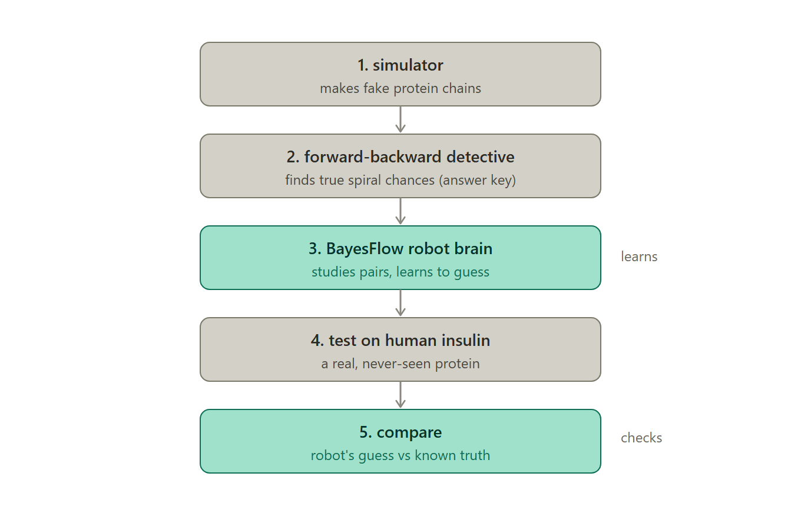
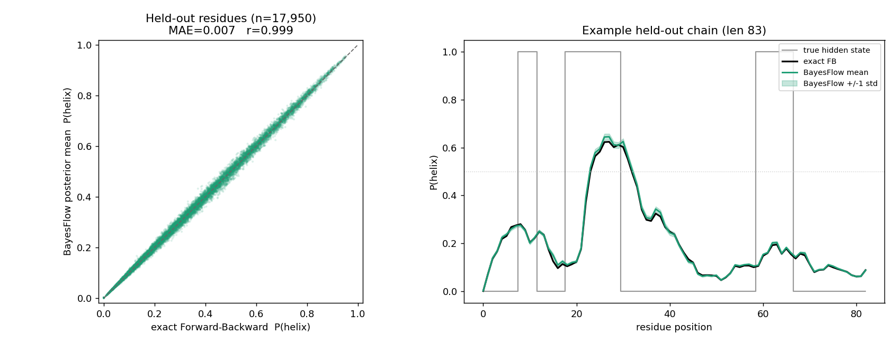
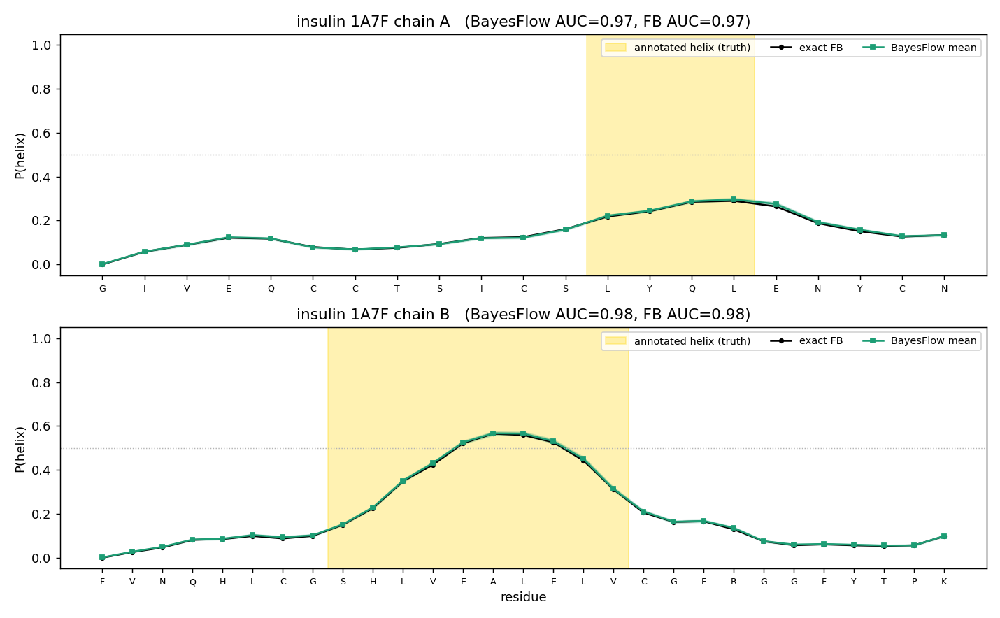
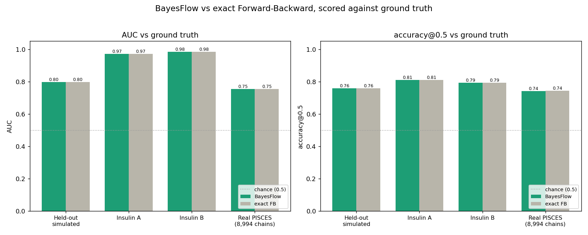

# SBI — Protein-Based Inference

### Predicting α-helix secondary structure with a two-state HMM and amortized **BayesFlow** inference


A **Simulation-Based Inference** project (TU Dortmund). We model the α-helix secondary
structure of proteins as a fixed **two-state Hidden Markov Model**, train a **BayesFlow**
amortized neural posterior to emulate exact Bayesian inference, and validate it on
held-out simulated chains *and* real proteins (human insulin + the full PISCES set).

---

## Overview

Every amino acid in a protein belongs to a local fold pattern (α-helix, β-sheet, or coil).
Solving 3-D structure experimentally (X-ray / NMR) is expensive, so we predict the α-helix
pattern **directly from the amino-acid sequence**.

- **Model.** A two-state HMM: hidden state ∈ {`helix`, `other`}, emitting one of the 20 amino acids.
- **Exact inference.** Forward–Backward (via `hmmlearn`) gives the exact per-residue `P(helix)`.
- **Amortized inference.** A normalizing flow (BayesFlow) learns to reproduce that posterior
  from a fixed-size sliding window — **instant inference with no HMM at test time**.
- **Evaluation.** Held-out simulated chains, human insulin, and ~9,000 real PISCES proteins,
  scored against ground truth with AUC and accuracy.

---

## The statistical model

The sequence always starts in `other`; the state path is a first-order Markov chain; each
state emits amino acids from its own table (all derived from empirical data).

| From \ To | helix | other |
|-----------|-------|-------|
| **helix** | 0.90  | 0.10  |
| **other** | 0.05  | 0.95  |

<p align="center"><br>
<em>Fig 1 — Two-state HMM: start rule and transition probabilities.</em></p>

<p align="center"><br>
<em>Fig 2 — Per-state amino-acid emission probabilities (α-helix vs other).</em></p>

**Sanity check — the model is realistic.** Measured against the real DSSP annotations:

| Quantity | Model | Real (PISCES) |
|---|---|---|
| P(helix→helix) | 0.90 | **0.912** |
| P(other→helix) | 0.05 | **0.041** |
| mean helix run | 10.0 | **11.4** |
| chains starting in `other` | 100% | **100%** |

---

## Method: amortized posterior with BayesFlow

A normalizing flow needs a **fixed-size** target, but chains vary in length. So we predict
**one residue at a time** from a fixed **31-residue window** (±15), slid along the chain, and
one-hot encode it as **31 × 21 channels** (20 amino acids + 1 padding for chain ends). Because
the window is only a local view, the target stays uncertain — a genuine posterior (mean ± std).

<p align="center"><br>
<em>Fig 3 — Sliding window → one-hot encoding → CouplingFlow posterior.</em></p>

Training targets come from exact Forward–Backward, so BayesFlow learns to reproduce the exact
Bayesian answer. Train/validation use **disjoint chain blocks** (front vs tail) with a runtime
assertion that no validation sequence appears in training — **verified no leakage**.

<p align="center"><br>
<em>Fig 4 — Full pipeline: simulator → Forward–Backward → BayesFlow → evaluation.</em></p>

---

## Repository structure

```
.
├── simulate.py            # 1. two-state HMM simulator (self-contained model definition)
├── forward_backward.py    # 2. exact per-residue P(helix) via hmmlearn (training targets)
├── train_bayesflow.py     # 3. windowed amortized posterior (CouplingFlow)
├── make_figures.py        # validation figure: BayesFlow vs exact FB
├── insulin_eval.py        # 4. human insulin (1A7F) vs ground truth
├── eval_real.py           # 4. all real PISCES proteins vs sst8 H-only labels
├── compare_metrics.py     # 5. consolidated comparison table + bar chart
├── SBI_pipeline.ipynb     # end-to-end notebook: every step in order, with diagrams
├── FINDINGS.md            # detailed lab notebook (model, checks, all results)
├── SBI_presentation.pptx / .pdf
├── *.png                  # figures
└── archive/               # ground-truth CSVs (see Data)
```

> **Not committed (large / generated):** `simulated_chains.csv` (~48 MB), `fb_targets.npz`
> (~86 MB), `bayesflow_posterior.keras` (~33 MB), and the `archive/*.csv` data — regenerate
> them with the commands below or download the data from Kaggle.

---

## Installation

```bash
python -m pip install numpy scikit-learn matplotlib hmmlearn "bayesflow>=2.0" keras torch nbformat
```

Tested with Python 3.13, `torch` 2.x (CPU), `keras` 3.x with `KERAS_BACKEND=torch`,
`bayesflow` 2.0.12, `hmmlearn` 0.3.3, `scikit-learn` 1.8. The scripts set the Keras backend
automatically.

---

## Reproduce the pipeline

Run in order (or just open `SBI_pipeline.ipynb` and *Restart & Run All*):

```bash
python simulate.py                 # 1. simulate 100,000 chains  -> simulated_chains.csv
python forward_backward.py         # 2. exact FB targets         -> fb_targets.npz
python train_bayesflow.py          # 3. train BayesFlow          -> bayesflow_posterior.keras
python make_figures.py             #    BayesFlow-vs-FB figure    -> validation_figure.png
python insulin_eval.py             # 4. insulin vs ground truth  -> insulin_prediction.png
python eval_real.py --limit 0      # 4. all real PISCES chains   -> real_eval_*.{csv,png}
python compare_metrics.py          # 5. comparison table + chart -> comparison*.png
```

Common flags: `train_bayesflow.py --train-chains N --max-windows M --epochs E`;
`eval_real.py --limit N --num-samples K`.

---

## Results

**BayesFlow reproduces exact Forward–Backward almost perfectly**, and both track ground truth
equally — capped by the model's Bayes-optimal ceiling (the emission tables overlap, so no
method can separate helix/other perfectly).

| Setting | AUC BayesFlow | AUC exact FB | Acc@0.5 BayesFlow | Acc@0.5 exact FB |
|---|---|---|---|---|
| Held-out simulated | 0.798 | 0.798 | 0.760 | 0.760 |
| Insulin A (real, 1A7F) | 0.971 | 0.971 | 0.810 | 0.810 |
| Insulin B (real, 1A7F) | 0.984 | 0.984 | 0.793 | 0.793 |
| Real PISCES (8,994 chains) | 0.754 | 0.754 | 0.743 | 0.743 |

On held-out simulated chains, BayesFlow vs exact FB: **correlation 0.999, MAE 0.007**.

<p align="center"><br>
<em>Fig 5 — BayesFlow posterior mean vs exact FB (r = 0.999); example chain with ±1 std band.</em></p>

<p align="center"><br>
<em>Fig 6 — Human insulin (1A7F): P(helix) rises inside the annotated helix on both chains.</em></p>

<p align="center"><br>
<em>Fig 7 — AUC and accuracy: BayesFlow vs exact FB across all four settings.</em></p>

---

## Design notes

- **Two alphabets, not one.** The 20 letters are **amino acids** (the input); the 8 DSSP
  states (Q8) are **structure labels** (the output). Our simulator emits the 20 amino acids —
  the same alphabet as real proteins — so there is no input mismatch. The simplification is on
  the *label* side: we use only 2 hidden states.
- **Label mapping.** Real DSSP `sst8` is collapsed to the strict definition: only `H` → helix,
  the other 7 states → other (cleaner than the standard Q3, which lumps G and I in with H).
- **AUC, not accuracy.** The fixed HMM is uncalibrated to real proteins, so absolute `P(helix)`
  runs low (insulin B-chain peaks ~0.56). Ranking (AUC) is the fair metric; accuracy@0.5 is
  depressed by that calibration gap.

See [`FINDINGS.md`](FINDINGS.md) for the full lab notebook (all validation checks and numbers).

---

## Data

Peptide sequences and DSSP secondary-structure annotations from the
[Protein Secondary Structure](https://www.kaggle.com/datasets/alfrandom/protein-secondary-structure)
dataset (a tabular transform of RCSB PDB, 2018-06-06):

- `archive/2018-06-06-ss.cleaned.csv` — full set (393,732 chains)
- `archive/2018-06-06-pdb-intersect-pisces.csv` — PISCES-culled, training-ready (9,078 chains)

Columns: `pdb_id, chain_code, seq, sst8, sst3, len, has_nonstd_aa`.

---

## References

1. DSSP secondary-structure assignment — <https://swift.cmbi.umcn.nl/gv/dssp/>
2. *Sixty-five years of the long march in protein secondary structure prediction: the final stretch?* (review)
3. BayesFlow — Radev et al., amortized Bayesian inference with normalizing flows — <https://bayesflow.org>
4. PISCES culling server — <https://academic.oup.com/bioinformatics/article/19/12/1589/258419>
5. Dataset curation — <https://github.com/zyxue/pdb-secondary-structure>

---

## Acknowledgements

Simulation-Based Inference course, TU Dortmund. Ground-truth data from RCSB PDB via the
Kaggle dataset above; culled subset from the PISCES server.
