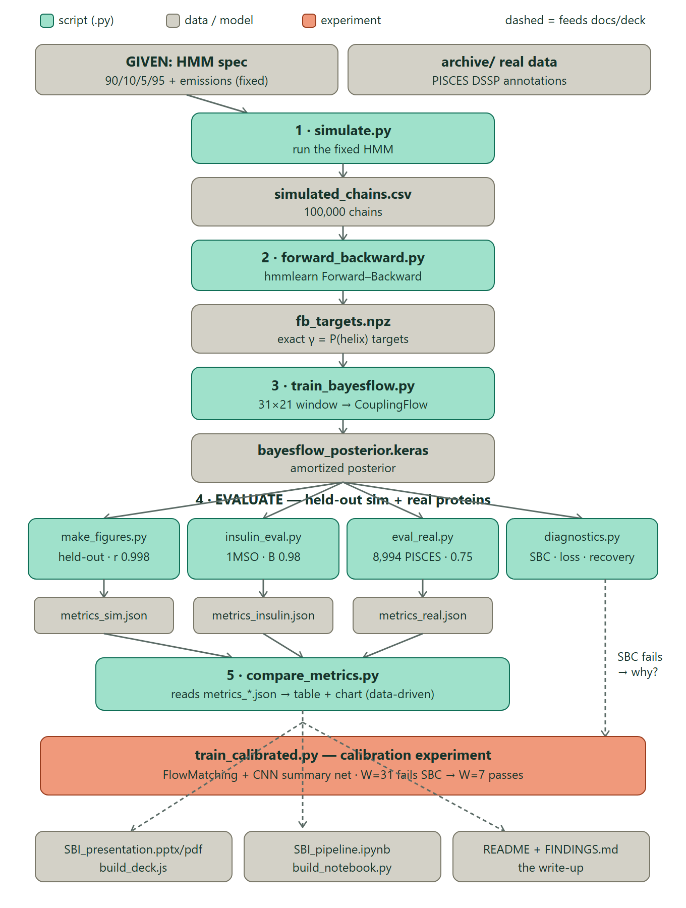
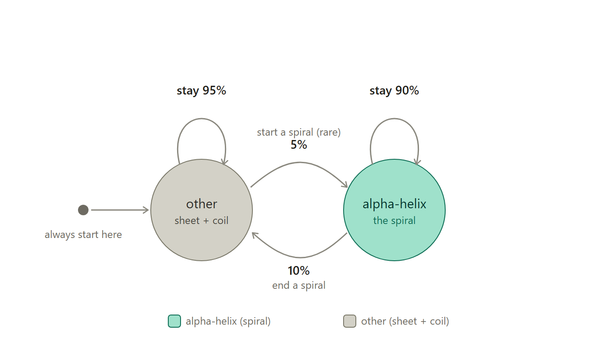
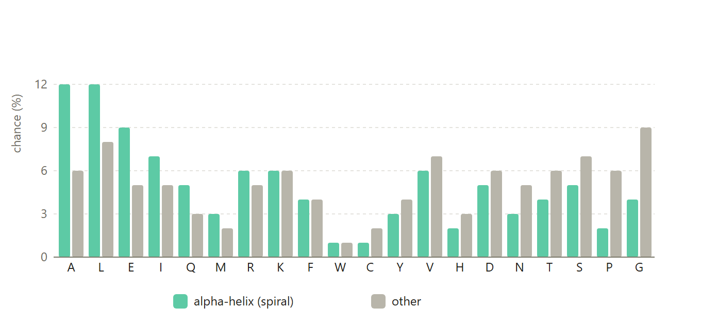
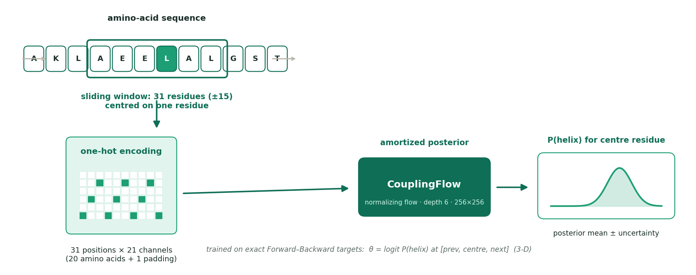
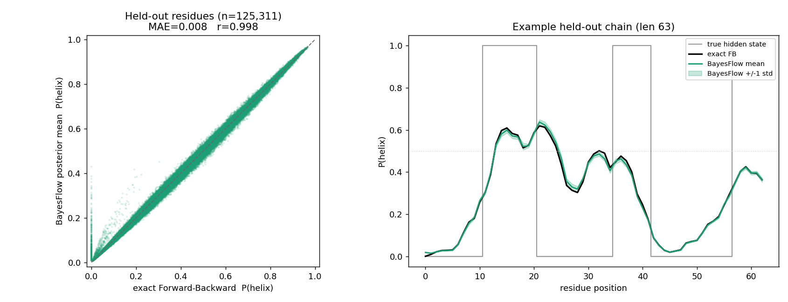
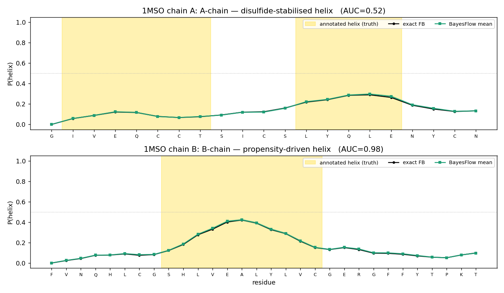
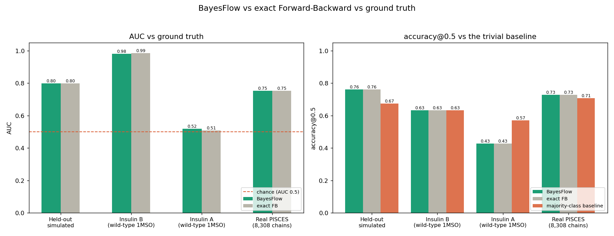
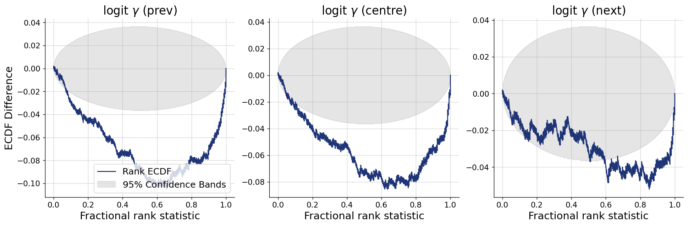

# SBI — Protein-Based Inference

### Predicting α-helix secondary structure with a two-state HMM and amortized **BayesFlow** inference


A **Simulation-Based Inference** project (TU Dortmund). We model the α-helix secondary
structure of proteins as a fixed **two-state Hidden Markov Model**, train a **BayesFlow**
amortized neural posterior to emulate exact Bayesian inference, and validate it on
held-out simulated chains *and* real proteins (human insulin + the full PISCES set).

---

## Overview

Every amino acid in a protein belongs to a local fold pattern (α-helix, β-sheet, or coil).
Solving 3-D structure experimentally (X-ray / NMR) is expensive, so we predict the α-helix
pattern **directly from the amino-acid sequence**.

- **Model.** A two-state HMM: hidden state ∈ {`helix`, `other`}, emitting one of the 20 amino acids.
- **Exact inference.** Forward–Backward (via `hmmlearn`) gives the exact per-residue `P(helix)`.
- **Amortized inference.** A normalizing flow (BayesFlow) learns to reproduce that posterior
  from a fixed-size sliding window — **instant inference with no HMM at test time**.
- **Evaluation.** Held-out simulated chains, human insulin, and ~9,000 real PISCES proteins,
  scored against ground truth with AUC and accuracy.

<p align="center"><br>
<em>Project data flow — every script, artifact, and the calibration experiment.</em></p>

---

## The statistical model

The sequence always starts in `other`; the state path is a first-order Markov chain; each
state emits amino acids from its own table (all derived from empirical data).

| From \ To | helix | other |
|-----------|-------|-------|
| **helix** | 0.90  | 0.10  |
| **other** | 0.05  | 0.95  |

<p align="center"><br>
<em>Fig 1 — Two-state HMM: start rule and transition probabilities.</em></p>

<p align="center"><br>
<em>Fig 2 — Per-state amino-acid emission probabilities (α-helix vs other).</em></p>

**Sanity check — the model is realistic.** Measured against the real DSSP annotations:

| Quantity | Model | Real (PISCES) |
|---|---|---|
| P(helix→helix) | 0.90 | **0.912** |
| P(other→helix) | 0.05 | **0.041** |
| mean helix run | 10.0 | **11.4** |
| chains starting in `other` | 100% | **100%** |

---

## Method: amortized posterior with BayesFlow

A normalizing flow needs a **fixed-size** target, but chains vary in length. So we predict
**one residue at a time** from a fixed **31-residue window** (±15), slid along the chain, and
one-hot encode it as **31 × 21 channels** (20 amino acids + 1 padding for chain ends). Because
the window is only a local view, the target stays uncertain — a genuine posterior (mean ± std).

<p align="center"><br>
<em>Fig 3 — Sliding window → one-hot encoding → CouplingFlow posterior.</em></p>

Training targets come from exact Forward–Backward, so BayesFlow learns to reproduce the exact
Bayesian answer. Train/validation use **disjoint chain blocks** (front vs tail) with a runtime
assertion that no validation sequence appears in training — **verified no leakage**.

> **What posterior are we estimating, and why a window?** Given the *full* sequence, the FB
> marginal γₜ is a *deterministic* function of the data (the HMM parameters are fixed), so
> `p(γₜ | full sequence)` is a point mass — nothing for a density estimator to learn. Conditioning
> on a **local window** integrates out the distant residues, making γₜ genuinely uncertain and
> giving a **non-degenerate** estimand `p(γₜ | window)` that BayesFlow can model. The window size
> is justified by fast mixing (λ₂ = 0.85 → influence < 10% beyond ±15). Trade-off: a larger window
> sharpens the point estimate but pushes the estimand toward the deterministic limit — which is why
> calibration (SBC) is the hard part (see Diagnostics).

<p align="center"><br>
<em>Fig 4 — Full pipeline: simulator → Forward–Backward → BayesFlow → evaluation.</em></p>

---

## Repository structure

```
.
├── sbi_pipeline_full.py    # ★ the ENTIRE pipeline in one self-contained file
├── SBI_pipeline.ipynb      # ★ the same pipeline as a notebook (step-by-step, with diagrams)
│
├── src/                    # the modular pipeline (imported by the notebook)
│   ├── simulate.py             # 1. two-state HMM simulator (the model definition)
│   ├── forward_backward.py     # 2. exact per-residue P(helix) via hmmlearn (targets)
│   ├── train_bayesflow.py      # 3. windowed amortized posterior (CouplingFlow)
│   ├── make_figures.py         #    held-out validation figure: BayesFlow vs exact FB
│   ├── insulin_eval.py         # 4. wild-type human insulin (1MSO) vs ground truth
│   ├── eval_real.py            # 4. all real PISCES proteins vs sst8 H-only labels
│   ├── compare_metrics.py      # 5. consolidated comparison table (data-driven)
│   ├── diagnostics.py          #    SBI diagnostics: SBC, recovery, contraction, loss
│   ├── emission_check.py       #    empirical emission tables vs real data
│   ├── train_calibrated.py     #    calibration experiment (FlowMatching + summary net)
│   └── experiment_pareto.py    #    accuracy↔calibration Pareto sweep over window size
│
├── figures/                # all figures (README + slides read from here)
├── outputs/                # metrics_*.json + per-chain CSVs (compare_metrics reads these)
├── build_deck.js           # generates SBI_presentation.pptx
├── build_notebook.py       # generates SBI_pipeline.ipynb
├── SBI_presentation.pptx / .pdf
├── figures/project_flow.svg / .png   # the data-flow diagram
├── README.md · FINDINGS.md · requirements.txt
└── archive/                # ground-truth CSVs (see Data; git-ignored)
```

Run the modular scripts from the repo root, e.g. `python src/compare_metrics.py`
(each script's paths resolve to the project root regardless of where it lives).

> **Not committed (large / generated, git-ignored):** `simulated_chains.csv` (~48 MB),
> `fb_targets.npz` (~86 MB), `*.keras` models (~33 MB), `logs/`, and `archive/*.csv` —
> regenerate with the commands below or download the data from Kaggle.

---

## Installation

```bash
python -m pip install numpy scikit-learn matplotlib hmmlearn "bayesflow>=2.0" keras torch nbformat
```

Tested with Python 3.13, `torch` 2.x (CPU), `keras` 3.x with `KERAS_BACKEND=torch`,
`bayesflow` 2.0.12, `hmmlearn` 0.3.3, `scikit-learn` 1.8. The scripts set the Keras backend
automatically.

---

## Reproduce the pipeline

**One-file version:** everything is also inlined in **`sbi_pipeline_full.py`** — the entire
pipeline (simulate → FB → train → evaluate → diagnostics) in a single self-contained script:

```bash
python sbi_pipeline_full.py                 # DEMO scale, all stages end-to-end (~minutes)
python sbi_pipeline_full.py --full          # real scale (100k chains, 30 epochs)
python sbi_pipeline_full.py --stages eval,diag   # run selected stages on the saved model
```

Or run the modular scripts in order (or open `SBI_pipeline.ipynb` and *Restart & Run All*):

```bash
python src/simulate.py                 # 1. simulate 100,000 chains  -> simulated_chains.csv
python src/forward_backward.py         # 2. exact FB targets         -> fb_targets.npz
python src/train_bayesflow.py          # 3. train BayesFlow          -> bayesflow_posterior.keras
python src/make_figures.py             #    BayesFlow-vs-FB figure    -> validation_figure.png
python src/insulin_eval.py             # 4. wild-type insulin (1MSO) -> insulin_1MSO.png
python src/eval_real.py --limit 0      # 4. all real PISCES chains   -> real_eval_*.{csv,png}
python src/compare_metrics.py          # 5. comparison + baseline    -> comparison*.png
python src/emission_check.py           #    emissions vs real data   -> emission_check.png
python src/diagnostics.py              #    SBI diagnostics (SBC etc) -> diag_*.png
```

Common flags: `src/train_bayesflow.py --train-chains N --max-windows M --epochs E`;
`src/eval_real.py --limit N --num-samples K`.

---

## Results

**BayesFlow reproduces exact Forward–Backward almost perfectly** (r = 0.998).

**Real-data headline (the quantitative claim): the full PISCES set.** Over **8,308 real chains**,
per-chain AUC = **0.753, 95% CI [0.750, 0.756]**; **96.7%** of chains beat chance and 73% exceed
0.70 (median 0.764). Human **insulin** (which the brief names as an *example*) is shown as a single
illustrative protein, not the evidence base — its B-chain is a clean textbook helix (AUC 0.98),
its A-chain is disulfide-stabilised and beyond a sequence-only model's reach (see below).

Full comparison, scored with a **majority-class baseline** for honesty:

| Setting | AUC BayesFlow | AUC exact FB | Acc@0.5 | Majority baseline |
|---|---|---|---|---|
| Held-out simulated | 0.797 | 0.798 | 0.760 | 0.675 |
| Insulin B — wild-type 1MSO | **0.981** [95% CI 0.93–1.00] | 0.986 | 0.633 | 0.633 |
| Insulin A — wild-type 1MSO | 0.519 [95% CI 0.24–0.78] | 0.509 | 0.429 | 0.571 |
| Real PISCES (8,308 both-class chains) | 0.753 | 0.754 | 0.728 | **0.708** |

On held-out simulated chains (125,311 residues), BayesFlow vs exact FB:
**correlation 0.9984, MAE 0.0079**. Pooled real-PISCES AUC over 2.2M residues: 0.770 / 0.772.

### SBI diagnostics — including one that fails

Convergence, recovery (r = 0.998) and posterior contraction (0.998) are excellent, but
**simulation-based calibration (SBC) fails**: a ~0.2 posterior-SD location bias. Point estimates
are unaffected; only a sensitive test like SBC catches it. We tested the leading hypothesis (the
`logit` clip atom at residue 0) by **retraining without it** — that removed the bias's sign
asymmetry but *not* the bias, so the hypothesis is **refuted**. Remaining suspect: the
near-degenerate 3-D target (dim-correlations 0.89–0.96) against a *coupling* flow. Documented
rather than hidden — see [`FINDINGS.md`](FINDINGS.md) §13, §16.

### Robustness

- **`num_samples` sensitivity:** reported AUCs are stable to ~0.001 across a 10× range of
  posterior draws (n = 50 → 500); the B-chain AUC is *identical* at every n. We use **n = 50**
  everywhere (`NUM_SAMPLES` in `train_bayesflow.py`).
- **Insulin CIs:** with only 21–30 residues, the B-chain result is robust (CI excludes chance)
  but the **A-chain result is not statistically claimable** (CI 0.25–0.79 straddles chance). The
  disulfide explanation is a hypothesis *consistent with* the data, not a demonstrated result.

> **On "ceiling":** exact FB is the Bayes-optimal ceiling **only on simulated data**, where the
> HMM *is* the true model. On real proteins the HMM is misspecified, so FB is **not** a ceiling —
> a better model can beat it.

> **Insulin caveat (important):** the wild-type structure **1MSO** is used. An earlier version
> used **1A7F**, which is a *mutant* (B16 Tyr→Glu, B24 Phe→Gly, des-B30) whose sparse A-chain
> annotation inflated the A-chain AUC to 0.97. On wild-type, the B-chain helix (propensity-driven)
> scores **0.98**, but the A-chain helix (disulfide-stabilised, cysteine-rich — and C *disfavours*
> helix in the emission table) is at **chance, 0.52**: a sequence-only HMM cannot see 3-D
> disulfide bonds. Insulin rests on only 2 chains — illustrative, not a benchmark.

<p align="center"><br>
<em>Fig 5 — BayesFlow posterior mean vs exact FB (r = 0.999); example chain with ±1 std band.</em></p>

<p align="center"><br>
<em>Fig 6 — Wild-type insulin (1MSO): the B-chain helix (propensity-driven) is recovered (AUC 0.98);
the A-chain helix (disulfide-stabilised) is not (AUC 0.52).</em></p>

<p align="center"><br>
<em>Fig 7 — AUC and accuracy@0.5 vs the majority-class baseline, BayesFlow vs exact FB.</em></p>

### SBI diagnostics

Beyond predictive metrics, we run inferential diagnostics. Convergence, recovery (r = 0.999),
and posterior contraction (0.999) are excellent, but **simulation-based calibration (SBC)
reveals a small (~0.15 posterior-SD) location bias** — the point estimate is superb, the
uncertainty band is not perfectly calibrated. Likely cause: the near-degenerate 3-D target
(inter-dim correlation 0.89–0.96) vs a coupling flow.

<p align="center"><br>
<em>Fig 8 — SBC rank ECDF: the curve exiting the 95% band signals the calibration bias.</em></p>

---

## Design notes

- **Two alphabets, not one.** The 20 letters are **amino acids** (the input); the 8 DSSP
  states (Q8) are **structure labels** (the output). Our simulator emits the 20 amino acids —
  the same alphabet as real proteins — so there is no input mismatch. The simplification is on
  the *label* side: we use only 2 hidden states.
- **Label mapping.** Real DSSP `sst8` is collapsed to the strict definition: only `H` → helix,
  the other 7 states → other (cleaner than the standard Q3, which lumps G and I in with H).
- **AUC, not accuracy.** The fixed HMM is uncalibrated to real proteins, so absolute `P(helix)`
  runs low (insulin B-chain peaks ~0.56). Ranking (AUC) is the fair metric; accuracy@0.5 is
  depressed by that calibration gap — and on insulin it only ties/loses to the majority-class
  baseline.
- **Where is the prior?** No parameters are inferred — start, transitions and emissions are all
  fixed. The **prior** is the induced distribution over hidden state paths `p(z₁:T)` given
  `startprob = [0,1]` and the transition matrix; the **likelihood** is the emission table. In the
  amortized setup the effective prior over θ is the marginal of `logit γ` induced by simulating
  chains and running FB — which is what SBC ranks against.
- **Target/condition mismatch — and why `r = 0.999` isn't suspicious.** θ is γ computed by FB from
  the **whole chain**, but we condition on a **31-residue window**, so the flow learns
  `p(γ_full | local window)`. This is harmless because the HMM mixes fast: the transition matrix's
  eigenvalues are exactly `[1.0, 0.85]`, so `λ₂ = 1 − 0.10 − 0.05 = 0.85` and influence decays
  geometrically — `0.85¹⁵ ≈ 0.09`, i.e. **<10% of the information lies outside ±15**. Empirically,
  γ from the window alone differs from full-chain γ by a median of only **0.010**. Near-perfect
  agreement is therefore the *expected* result, not evidence of leakage.
- **Why SBI when the likelihood is tractable?** Because **the tractability is the point.** This is
  a benchmark setting where the exact posterior is *known*, which is the only way to verify that an
  amortized neural posterior is faithful. In a real SBI problem the likelihood is intractable and
  this check is impossible.
- **No summary network (deliberate, and a known gap).** The 31×21 window is flattened to 651 and fed
  straight in as `inference_conditions`. A 1D-CNN summary net would be the canonical BayesFlow
  choice; it is expected to change nothing numerically and would **not** fix the SBC bias (which
  lives on the target side).

See [`FINDINGS.md`](FINDINGS.md) for the full lab notebook (all validation checks and numbers).

---

## Data

Peptide sequences and DSSP secondary-structure annotations from the
[Protein Secondary Structure](https://www.kaggle.com/datasets/alfrandom/protein-secondary-structure)
dataset (a tabular transform of RCSB PDB, 2018-06-06):

- `archive/2018-06-06-ss.cleaned.csv` — full set (393,732 chains)
- `archive/2018-06-06-pdb-intersect-pisces.csv` — PISCES-culled, training-ready (9,078 chains)

Columns: `pdb_id, chain_code, seq, sst8, sst3, len, has_nonstd_aa`.

---

## References

1. DSSP secondary-structure assignment — <https://swift.cmbi.umcn.nl/gv/dssp/>
2. *Sixty-five years of the long march in protein secondary structure prediction: the final stretch?* (review)
3. BayesFlow — Radev et al., amortized Bayesian inference with normalizing flows — <https://bayesflow.org>
4. PISCES culling server — <https://academic.oup.com/bioinformatics/article/19/12/1589/258419>
5. Dataset curation — <https://github.com/zyxue/pdb-secondary-structure>

---

## Acknowledgements

Simulation-Based Inference course, TU Dortmund. Ground-truth data from RCSB PDB via the
Kaggle dataset above; culled subset from the PISCES server.
